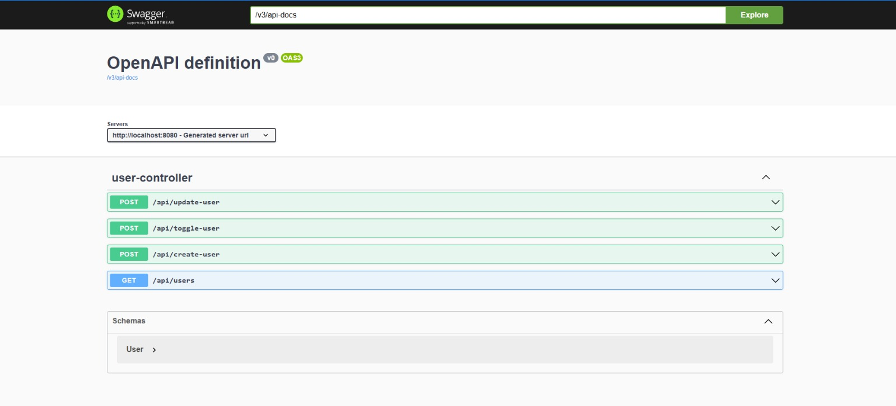

# 👩‍💻 User Management API – Spring Boot + MongoDB

This is a simple REST API project for managing users, built using **Java 17**, **Spring Boot**, and **MongoDB**. It supports creating, updating, listing, and toggling user activation status.

---
# 📌 Table of Contents

* [Features](#features)

* [MongoDb Document Structure](#mongodb-document-structure)

* [Technologies Used](#technologies-used)

* [Project Structure](#project-structure)

* [API Endpoints](#api-endpoints)

* [How to Run the Project](#how-to-run-the-project)

* [MongoDB Setup](#mongodb-setup)

* [OpenAPI Documentation](#openapi-documentation)

* [Git Ignore Setup](#git-ignore-setup)

* [Swagger UI Screenshot](#swagger-ui-screenshot)

* [API Testing Examples](#api-testing-examples)

* [Author](#author)

## ✅ Features

- `POST /api/create-user` – Create a new user
- `POST /api/update-user` – Update existing user details
- `GET /api/users` – List all users
- `POST /api/toggle-user?id=` – Activate or deactivate a user

---

## 🧾 MongoDB Document Structure

```json
{
  "_id": "ObjectId",
  "email": "string",
  "firstName": "string",
  "lastName": "string",
  "isActive": true,
  "tenantId": "string",
  "createdAt": "datetime",
  "updatedAt": "datetime"
}
```

## ⚙️ Technologies Used

* Java 17

* Spring Boot 3.2.4

* MongoDB (local)

* Maven

* IntelliJ IDEA

* Git & GitHub

* Postman (for API testing)

* Swagger (springdoc-openapi-ui)

## 📁 Project Structure

````
user-api-springboot/
├── src/
│   ├── main/
│   │   ├── java/com/example/userapi/
│   │   │   ├── controller/
│   │   │   ├── model/
│   │   │   ├── repository/
│   │   │   └── service/
│   │   └── resources/
│   │       └── application.properties
├── pom.xml
├── README.md
````

## 🔍 API Endpoints

| Method | Endpoint             | Description                    |
|--------|----------------------|--------------------------------|
| POST   | `/api/create-user`   | Create a new user              |
| POST   | `/api/update-user`   | Update existing user info      |
| GET    | `/api/users`         | Fetch list of all users        |
| POST   | `/api/toggle-user`   | Toggle user activation by ID   |


## 🚀 How to Run This Project

### **🖥️ Prerequisites**

* MongoDB running locally on ```mongodb://localhost:27017```

* Java 17 installed

* IntelliJ IDEA (or other Java IDE)

### 📦 **Steps to Run

**1. Clone the repo:**

````git clone https://github.com/srijeeta0425/user-api-springboot.git````

**2. Open the project in IntelliJ IDEA**

**3. Configure MongoDB if needed in:**
````
src/main/resources/application.properties
````
**4. Run the application:**

Open ````UserApiApplication.java````

Click the green Run button or use ````Shift + F10````

**5. Test the API in Swagger UI:**

### **🚀 Run Commands**
````
# Install dependencies and build the project

mvn clean install

# Run the Spring Boot application
mvn spring-boot:run
````
The application runs on:
````
http://localhost:8080
````
## 🗃️ MongoDB Setup

### Step-by-step:

1. Download MongoDB Community Edition from MongoDB Downloads

2. Start MongoDB server (default port is 27017)

3. Make sure MongoDB is running

4. In application.properties, set the URI:
````
spring.data.mongodb.uri=mongodb://localhost:27017/user-api-db
````
Spring Boot will auto-create the collections.

## OpenAPI Documentation

### Swagger Setup

Included dependency in ```pom.xml```:
````
<dependency>
    <groupId>org.springdoc</groupId>
    <artifactId>springdoc-openapi-ui</artifactId>
    <version>1.6.14</version>
</dependency>
````
Swagger Endpoints:

* Swagger UI: http://localhost:8080/swagger-ui.html

* OpenAPI JSON: http://localhost:8080/v3/api-docs

## 📂 Git Ignore Setup

A .gitignore file was added to exclude unnecessary files:
````
# Build output
/target/

# IDE settings
/.idea/
*.iml

# OS clutter
.DS_Store
Thumbs.db
````
## 📸 Swagger UI Screenshot
````

````
### Example 
1. ````POST```` request to ````/api/create-user:````
````
{
  "email": "srijeeta@gmail.com",
  "firstName": "Srijeeta",
  "lastName": "Purkait",
  "tenantId": "getpostlabs123"
}
```` 
2. ````POST```` request to ````/api/update-user:````
````
{
  "email": "updated@gmail.com",
  "firstName": "Updated",
  "lastName": "Name",
  "tenantId": "newTenant"
}
````
3.````GET```` request to ````/api/users:````
````
{
  "email": "srijeeta@gmail.com",
  "firstName": "Srijeeta",
  "lastName": "Purkait",
  "tenantId": "getpostlabs123"
}
````
4. ````POST```` request to ````/api/toggle-user:````
````
{
  "email": "updated@gmail.com",
    "firstName": "Updated",
    "lastName": "Name",
    "tenantId": "newTenant"
}
````


## 🙋‍♀️ Author
Srijeeta Purkait

Software Engineer Trainee– [GetPost Labs]

📫 Email: srijeeta@getpostlabs.io

🔗 GitHub: https://github.com/srijeeta0425/user-api-springboot

